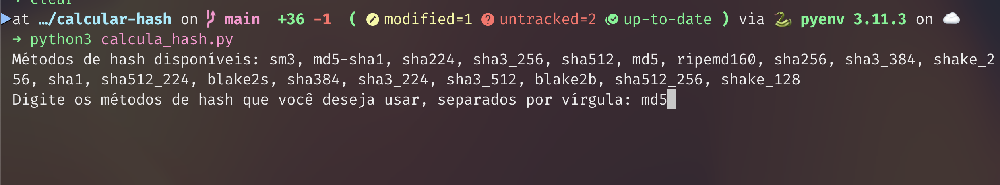
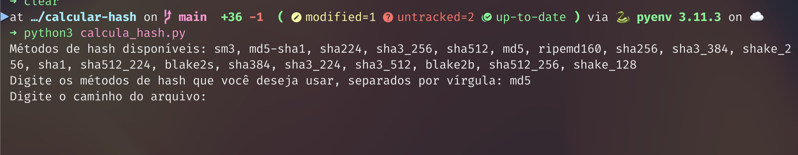
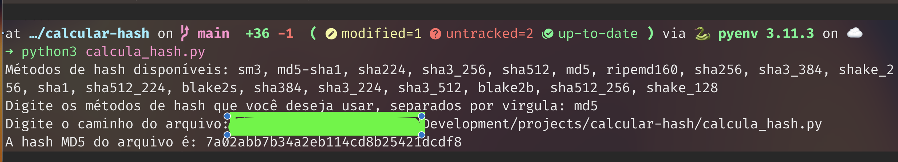

# Nome do projeto: calcular-hash-de-arquivo

## Calcula o código hash de um arquivo com base em uma função **_hash_**.

- Este programa usa uma biblioteca Pyhton chamada **_hashlib_**. Ela tem todas as hahes disponiveis no momento.

### O que é uma **_função hash_**?

    Uma função de hash criptográfico, é conhecida como hash - é um algoritmo matemático que transforma qualquer bloco de dados em uma série de caracteres de comprimento fixo.

Para saber mais ==> [função hash](https://pt.wikipedia.org/wiki/Fun%C3%A7%C3%A3o_hash).

    - A função escolher_metodos exibe os métodos de hash disponíveis e solicita ao usuário que digite os métodos desejados.

    - O usuário digita os métodos separados por vírgula, e o programa verifica se cada método é válido.

    - Se todos os métodos são válidos, o programa solicita o caminho do arquivo e calcula as hashes usando os métodos escolhidos.

### Como usar:

- Rodar o código escrito em 
  `python3 <nome-programa> `.

- Escolha o Hash que deseja usar. Pode ser escolhido mais de um. Eles devem ser separados por uma ','.
  Exemplo: MD5, SHA-1, SHA-256

- Informe o caminho e nome do arquivo.

Use este código para fazer os seus testes. Observe o código hash gerado e faça alteração no arquivo. Gere outra hash para obeservar a mudança no código gerado.

Prints:

